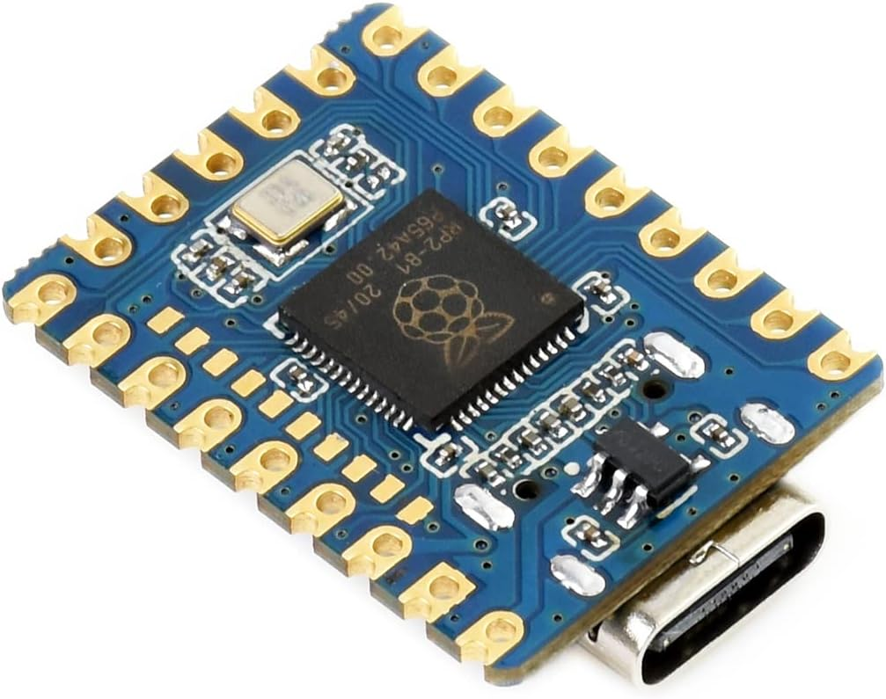
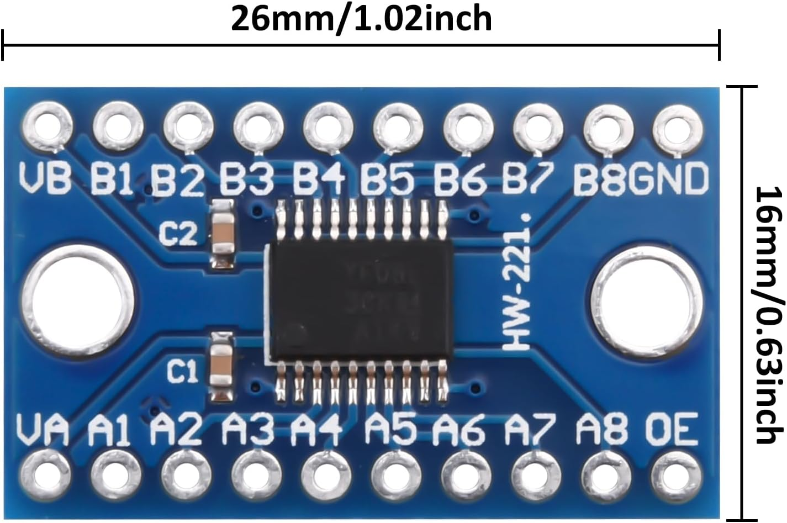
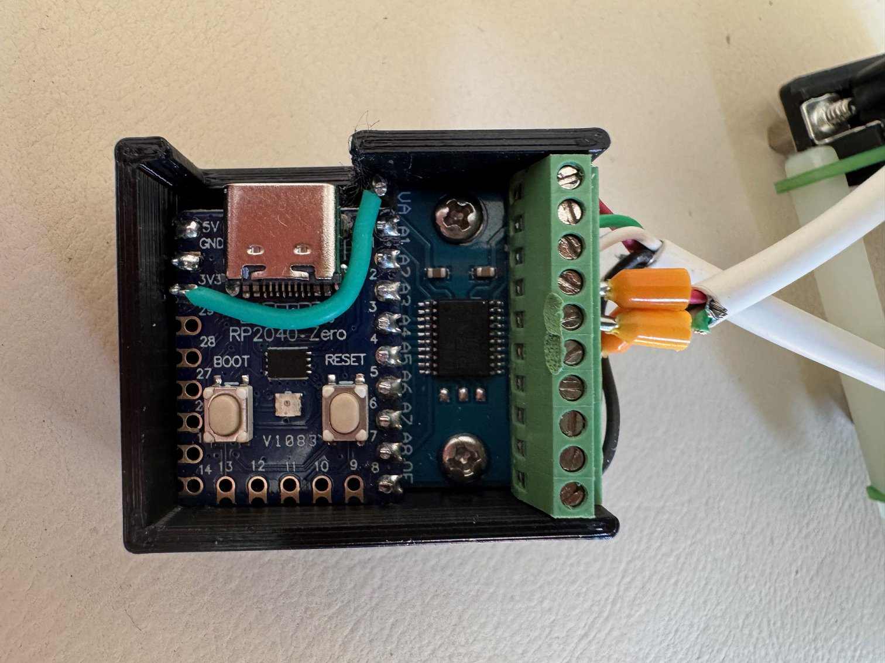
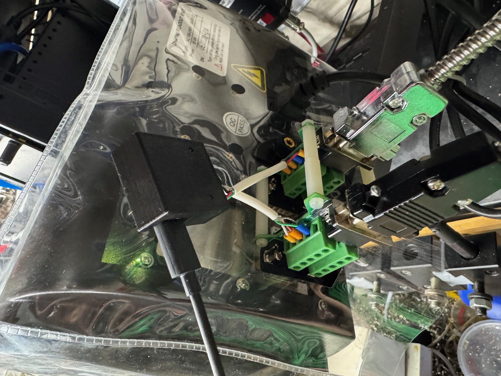

# RP2040 LinuxCNC HAL Quadrature Encoder Interface

A USB quadrature encoder interface that connects DRO scales to LinuxCNC using an RP2040 microcontroller.

## Overview

This project allows you to connect existing DRO (Digital Read Out) scales with TTL level A/B quadrature signals to LinuxCNC through a simple USB connection. It splices into the existing DB9 connector/cables so your existing DRO continues to function. Common brands which work include [TOAUTO](https://www.toautotool.com/products/2-3-axis-dro-kit-standard-scales) and other similar 5V TTL quadrature encoder scales. It uses readily available components:

**Waveshare RP2040-Zero:**

**TXS0108E 8 Channel Logic Level Converter:**

## Finished board

Spliced into the existing DRO, there are likely nicer looking solutions than this:

## Features

- Supports 4 DRO scales with TTL A/B quadrature signals (X, Y, Z, A axes)
- High-speed PIO-based encoder counting
- 32-bit position counters
- USB interface with LinuxCNC HAL component
- Configurable scale factors
- Test mode for development and debugging

## Quick Start

See the individual directories for detailed instructions:
- [`rp2040-firmware/`](rp2040-firmware/) - RP2040 firmware
- [`linuxcnc-hal/`](linuxcnc-hal/) - LinuxCNC HAL component
- [`hardware/`](hardware/) - Hardware setup and wiring 
